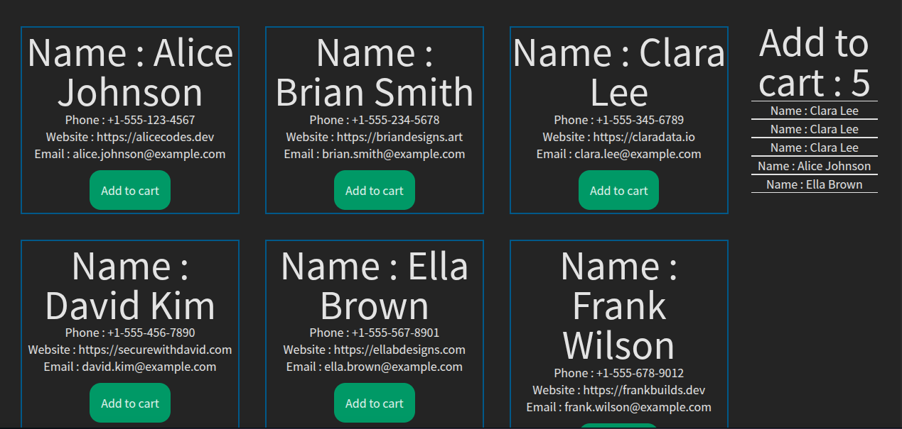

# Simple-Add-to-Cart-System
Simple react project with tailwind-Css 

🌟 Large Screen  


⚡ Responsive Design  


---
## 📂 Project File Structure
```
 Simple-Add-to-Cart-System/
│── src/
│   ├── assets/
│   │   └── overview/
│   │       ├── overview-1.png
│   │       └── overview-2.png
│   └── components/
│       ├── Placement/
│       │   └── Placement.jsx
│       ├── Product/
│       │   └── Product.jsx
│       ├── Products/
│       │   └── Products.jsx
│       └── SingleCart/
│           └── SingleCart.jsx
│
│── src/
│     ├──public
│          ├── FakeData.json
│          └── vite.svg
│


```